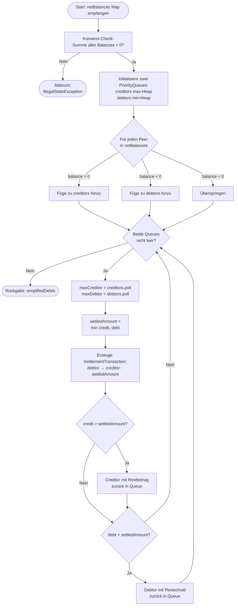

#### In a Nutshell
```Markdown
- Layer 2 Währungssystem auf Basis des [ASAP-Frameworks](github.com/SharedKnowledge)
	- P2P Kommunikation, ohne zentralen Server
- Promises statt Echtgeld
	- kryptografisch signierte Schuldversprechen
- Gruppen als geschlossene Wirtschaftsräume
- Settlement Party
	- dezentraler Konsens Mechanismus
	- reduziert Anzahl der Transaktionen
- Blockchain-Anbindung (Ethereum / Sepolia Testnet)
- Trust-Based
```

---

### Architektur
#### Komponenten

| Listener                                   | Kommentar                                                                                                                                                  |
| ------------------------------------------ | ---------------------------------------------------------------------------------------------------------------------------------------------------------- |
| **Interfaces**                             |                                                                                                                                                            |
| `SharkCurrencyMessageHandler`              | Generisches Interface mit `handle(uri, messages, pki, receiver)`. Jede Nachrichtenart (Invite, Promise, Settlement, ...) implementiert es nach Strategy-Muster. |
| `SharkCurrencyListener`                    | High-Level Listener, der `sharkCurrencyMessageReceived(uri, messages)` an die App weiterreicht — wird in Tests/UI subscribed.                              |
| **GroupHandler**                           |                                                                                                                                                            |
| `SharkGroupInviteHandler`                  | Empfängt Gruppeneinladungen über `INVITE_CHANNEL_URI`, deserialisiert das `SharkGroupDocument` und legt es als *pendingInvite* im Storage ab.              |
| `SharkGroupUpdateHandler`                  | Verarbeitet Updates am `SharkGroupDocument` (z. B. neue Whitelist, geänderte Optionen) — entschlüsselt verschlüsselte Updates über den PKI-Keystore.        |
| `SharkNewMemberHandler`                    | Wird ausgelöst, wenn ein neuer Peer der Gruppe beitritt; aktualisiert das lokale Group-Document und stößt die Verteilung des aktuellen Stands an.          |
| **PromiseHandler**                         |                                                                                                                                                            |
| `SharkPromiseAskSigCredHandler`            | "Bitte signiere als Creditor": Der lokale Peer prüft, ob er Gläubiger ist, signiert das Promise und sendet es zurück.                                      |
| `SharkPromiseAskSigDebHandler`             | "Bitte signiere als Debtor": Spiegelbild zum oberen Handler — der Schuldner wird zur Signatur aufgefordert.                                                |
| `SharkPromiseTransferNotificationHandler`  | Benachrichtigt über den Transfer eines bestehenden Promises an einen neuen Peer (Rollenwechsel Creditor/Debtor).                                           |
| `SharkPromiseRevSigPromHandler`            | Empfang eines vollständig (von beiden Seiten) signierten Promises — bewegt es vom Pending- in den Signed-Storage.                                          |
| `SharkPromiseAskForDebtSettledHandler`     | Eine Schuld soll bilateral beglichen werden — der Empfänger entscheidet über Annahme/Ablehnung.                                                            |
| `SharkPromiseResponseForDebtSettledHandler`| Verarbeitet die Antwort auf eine Settlement-Anfrage und entfernt das Promise aus dem aktiven Storage.                                                      |
| **Settlement Party**                       |                                                                                                                                                            |
| `SharkSettlementHandler`                   | Kernstück der Settlement Party: empfängt `SharkSettlementDocument`s, mergt die Netto-Bilanzen aller Peers und triggert Zustandsübergänge (`SettlementPartyState`). |

How-To-Use für die Listener wird in [How To Start](#how-to-start) gezeigt.

| `SharkCurrencyStorage` (Methoden)                            | Was es macht                                                                                  |
| ------------------------------------------------------------ | --------------------------------------------------------------------------------------------- |
| `saveGroupDocument` / `getGroupDocument`                     | Persistiert bzw. liest ein `SharkGroupDocument` pro Gruppe.                                   |
| `addMemberToGroupDocument`                                   | Fügt einem bestehenden Gruppen-Dokument einen neuen, signierten Peer hinzu.                   |
| `savePendingInvite` / `getPendingInvite` / `removePendingInvite` | Verwaltet noch nicht angenommene Einladungen.                                              |
| `addSharkSignedPromiseToStorage` / `getSharkSignedPromiseFromStorage` | Speichert bzw. liest vollständig signierte Promises.                                  |
| `addSharkPendingPromiseToStorage` / `getSharkPendingPromiseFromStorage` | Hält Promises vor, die auf eine zweite Signatur warten.                              |
| `getSignedPromisesForGroup`                                  | Liefert alle finalisierten Promises einer Gruppe — Basis für die Bilanzberechnung.            |
| `addSharkToBeSettledPromiseToStorage` / `getToBeSettledPromises` | Markiert Promises, die in die nächste Settlement Party einfließen sollen.                  |
| `saveSettlementDocument` / `getSettlementDocument`           | Persistenz der Settlement-Dokumente pro Party-ID.                                             |
| `addExecutedSettlement` / `hasSettlementBeenExecuted`        | Idempotenz-Schutz: verhindert doppelte Ausführung einer Settlement Party.                     |
| `putPromiseCreation` / `getCreationCounter`                  | Zählt erzeugte Promises pro Gruppe (z. B. für Rate Limiting / Promise-IDs).                   |
| `isEncryptedByCurrency`                                      | Gibt zurück, ob die Gruppe einer Currency Verschlüsselung verwendet.                          |

Der Storage wird sowohl in der API (über den Getter `getSharkCurrencyStorage()`) als auch in den Handlern via Konstruktor-Injection verwendet.

---

#### Konzeptionelle Ideen

| Gruppen | Promises | Settlement Parties |
| --- | --- | --- |
| Eine Gruppe ist der geschlossene Wirtschaftsraum für eine Currency. Optionen: **whitelisted** (nur freigegebene Peers dürfen mitwirken), **encrypted** (Channel-Nachrichten sind PKI-verschlüsselt), **centralized** (nur der Ersteller darf neue Promises erzeugen — andere dürfen nur transferieren) und **balanceVisible** (Bilanzen anderer Peers sichtbar oder verborgen). Jede Gruppe ist auf einen ASAP-Channel mit der URI der Currency gemappt. | Ein Promise ist ein kryptografisch signiertes Schuldversprechen über einen `amount` einer `SharkCurrency`, gebunden an `creditorId` und `debtorId`. Erst wenn **beide** Seiten signiert haben, gilt es als "fully signed" und wirkt auf die Bilanz. Promises können transferiert, bilateral beglichen (`askForDebtSettled`) oder in einer Settlement Party verrechnet werden. | Eine Settlement Party konsolidiert alle offenen Promises einer Gruppe. Ein Peer initiiert via `initiateSettlementParty(groupId)`, woraufhin alle Mitglieder ihre Netto-Bilanzen broadcasten. Der `SettlementHandler` mergt den gemeinsamen Zustand; sobald die Summe aller Bilanzen `0` ergibt (Konsens-Check), berechnet die gewählte `SettlementStrategy` die minimale Menge an Transaktionen. |

---

##### Settlement Parties
Der Algorithmus basiert auf dem **Strategy-Pattern** (`SettlementStrategy` Interface) — es kann jederzeit ein effizienterer Algorithmus implementiert und in `SettlementParty` injiziert werden, sobald das System eine kritische Menge an Peers erreicht.

Mathematisch betrachtet löst der Greedy-Algorithmus das *Debt Simplification Problem*: Gegeben $n$ Peers mit Netto-Bilanzen $b_1, b_2, \dots, b_n$, wobei

$$
\sum_{i=1}^{n} b_i = 0
$$

als Konsens-Bedingung gilt (jede geschlossene Wirtschaft ist ein Nullsummenspiel), wird die Zahl der nötigen Transaktionen auf maximal $n-1$ reduziert — in der Praxis meist deutlich weniger.

Die **Laufzeitkomplexität** ergibt sich aus der Verwendung zweier `PriorityQueue`s (Heaps): pro Schritt $O(\log n)$ für Einfügen/Entfernen, bei höchstens $n-1$ Iterationen also insgesamt $O(n \log n)$ Laufzeit bei $O(n)$ Platz.

Den Ablauf des Greedy-Algorithmus zeigt das folgende Mermaid-Flussdiagramm:



**Kurz beschrieben:** In jedem Schritt wird der größte Gläubiger gegen den größten Schuldner verrechnet. Der kleinere der beiden Beträge wird als Transaktion festgeschrieben; der Rest verbleibt in der Queue. Das wiederholt sich, bis eine der beiden Queues leer ist — was wegen des Nullsummen-Konsens garantiert ist.

---

#### How To Start
> Tipp: Schaut zusätzlich in `src/test/java/` — die Tests (`CurrencyUnencryptedGroupTests`, `PromisesTest`, `SettlementPartyTests`, ...) sind die aktuell vollständigste Anwendungsreferenz.

Der **Lifecycle** eines typischen Use-Case sieht so aus:

```
Currency erstellen → Gruppe etablieren → Mitglieder einladen → Promises austauschen → Settlement Party → Gruppe schließen
```

**1) Component & Listener registrieren**
```java
SharkCurrencyComponentFactory factory = new SharkCurrencyComponentFactory(pkiComponent);
sharkPeer.addComponent(factory, SharkCurrencyComponent.class);
SharkCurrencyComponent currency =
        (SharkCurrencyComponent) sharkPeer.getComponent(SharkCurrencyComponent.class);

// Eigenen Listener subscriben (z. B. für UI-Events)
currency.subscribeSharkCurrencyListener(myListener);
```

**2) Currency anlegen (lokal oder mit Krypto-Referenz)**
```java
SharkCurrency localCurrency = new SharkLocalCurrency("AsapTaler");
// oder mit Referenz auf eine echte Kryptowährung:
SharkCurrency cryptoRef    = new SharkCryptoCurrency("AsapEth", "ETH");
```

**3) Gruppe etablieren** — verschiedene Optionen je nach Vertrauensmodell
```java
ArrayList<CharSequence> whitelist = new ArrayList<>(List.of("Alice", "Bob", "Charlie"));
byte[] groupId = currency.establishGroup(
        localCurrency,
        whitelist,
        /* centralized    */ false,
        /* encrypted      */ true,
        /* balanceVisible */ true
);
```

**4) Mitglieder einladen / Einladung annehmen**
```java
// Sender:
currency.invitePeerToGroup(groupId, "Willkommen!", "Bob");

// Empfänger (nachdem der Invite-Handler die Einladung im Storage abgelegt hat):
currency.acceptInviteAndSign("AsapTaler");
```

**5) Promise erzeugen und versenden**
```java
CharSequence promiseId = currency.createPromise(
        /* amount      */ 100,
        /* reference   */ localCurrency,
        /* groupId     */ groupId,
        /* creditorId  */ "Alice",
        /* debtorId    */ "Bob",
        /* asCreditor  */ true
);
currency.sendPromise(promiseId, false, "Alice", Set.of("Bob"), true, true, uri);
```
Nachdem beide Seiten über die `…AskSigCred`/`…AskSigDeb` Handler signiert haben, landet das Promise als *fully signed* im Storage und beeinflusst `getBalance(...)`.

**6) Settlement Party starten**
```java
byte[] partyId = currency.initiateSettlementParty(groupId);
// Der SharkSettlementHandler sammelt nun die Netto-Bilanzen aller Peers,
// prüft die Konsens-Bedingung (Summe = 0) und führt die GreedySettlementStrategy aus.
```

**7) Zukünftige Erweiterung:** Promises sollen perspektivisch auch *außerhalb* einer Gruppe versendet werden können — die API ist bereits darauf vorbereitet (Promise-Transfer via `transferPromiseToAnotherPeer`).

---
